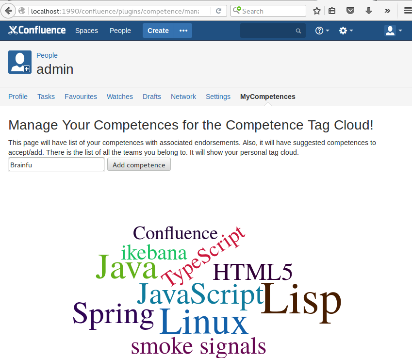

# competence
A Confluence plug-in for managing the competences in the organization, in LinkedIn style with tag clouds.

This is work-in-progress. When complete, this will have:
* Management of teams, automatic generation of tag clouds per team and for the whole company.
* Navigating between tags and people, clicking a tag gives the list of people with that competence.
* Endorsement and suggestions of competence tags for colleagues.
* Competence tags are enforced to be Wikipedia article names, and have links to Wikipedia.

To get the initial content for the tag autocomplete, run the: `./getWikipediaArticles.sh`

Also run: `cd src/main/resources/js; npm install`

Create Eclipse project files with: `atlas-mvn eclipse:eclipse`

Run with: `atlas-run` (If you get weird errors about required plugin missing, you can try
`-Datlassian.plugins.enable.wait=300`)

Take your browser to: `http://localhost:1990/confluence`

The credentials are: admin/admin

See also: [TODO.md](./TODO.md)

Screenshots
===========

